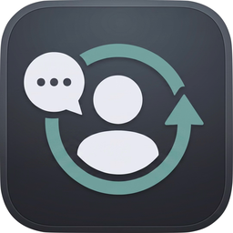

<div align="center">
  
  <h1>AutoCRM</h1>
  <p><strong>Know the last time you contacted someone, who needs a follow-up, and who has gone quiet for too long.</strong></p>
  <p>AutoCRM runs quietly on macOS, records recent communication activity locally, and keeps your Notion people database current.</p>
  <p>
    <a href="https://github.com/akpiya/AutoCRM/releases">Download</a>
    ·
    <a href="#4-install">Install</a>
    ·
    <a href="#troubleshooting">Troubleshooting</a>
    ·
    <a href="#privacy">Privacy</a>
  </p>
</div>

> **Full Disk Access required:** AutoCRM needs macOS Full Disk Access to read Messages and call history. Without it, the app can install but cannot collect useful communication activity.

AutoCRM reads recent iMessage/SMS and phone/FaceTime activity from your Mac, stores pending updates in a local SQLite outbox, and syncs matched people in a Notion database.

## Current Status

Implemented:

- iMessage/SMS activity
- phone and FaceTime call activity
- Notion sync
- background installation with LaunchAgent

Not implemented yet:

- Beeper Desktop collection

Because AutoCRM is not notarized by Apple, macOS may warn you before running it. You can still use it, but you will need to approve it manually in System Settings.

## Requirements

- macOS
- a Notion account
- a Notion integration token
- a Notion people database
- Full Disk Access for the installed AutoCRM app

You do not need Go installed if you download a release zip.

## 1. Create a Notion Integration

1. Open [Notion integrations](https://www.notion.so/my-integrations).
2. Create a new internal integration.
3. Copy the integration secret. AutoCRM will ask for this during install.

## 2. Create the Notion Database

Create or choose a Notion database for people.

You can duplicate this compatible Notion template to start with the required schema:

https://inquisitive-ice-1d4.notion.site/3846af520ced80d09a67c6a75abbd1de?v=34e6af520ced8248bb318831bced6ecb

AutoCRM requires these property names exactly:

| Property | Type | Notes |
|----------|------|-------|
| `Name` | Title | Your person's name. |
| `Phones` | Multi-select | One phone number per tag. Formatting can vary. |
| `Emails` | Email or Multi-select | Email matching is case-insensitive. |
| `Last Contacted` | Date | AutoCRM updates this when it sees newer activity. |
| `Last Channel` | Select | Include `Text`, `Phone`, and `Facetime` options. |

Then share the database with your Notion integration:

1. Open the database in Notion.
2. Click `...` in the top-right.
3. Choose `Connections`.
4. Add your integration.

Copy the database ID from the database URL. AutoCRM will ask for it during install.

## 3. Download AutoCRM

Download the correct zip from GitHub Releases:

- Apple Silicon Macs: `autocrm-macos-arm64.zip`
- Intel Macs: `autocrm-macos-amd64.zip`

Most M1, M2, M3, and M4 Macs use Apple Silicon.

Unzip the file. It contains:

```text
AutoCRM.app
README.txt
```

## 4. Install

Open Terminal in the unzipped folder and run:

```bash
./AutoCRM.app/Contents/MacOS/autocrm install
```

If macOS says AutoCRM is damaged, blocked, or cannot be opened, remove the download quarantine flag and try again:

```bash
xattr -dr com.apple.quarantine ./AutoCRM.app
```

You may also need to open System Settings > Privacy & Security and approve AutoCRM.

The installer will:

1. Show the required Notion database setup.
2. Ask for your Notion integration token.
3. Ask for your Notion database ID.
4. Validate that Notion is reachable and has the required properties.
5. Copy AutoCRM to `~/.autocrm/AutoCRM.app`.
6. Write `~/Library/LaunchAgents/com.user.autocrm.plist`.
7. Guide you through enabling Full Disk Access.
8. Load the background LaunchAgent.

The default background sync interval is 5 minutes.

The Notion token and database ID are stored locally in:

```text
~/Library/LaunchAgents/com.user.autocrm.plist
```

## 5. Enable Full Disk Access

AutoCRM reads these local macOS databases:

- `~/Library/Messages/chat.db`
- `~/Library/Application Support/CallHistoryDB/CallHistory.storedata`

macOS blocks those files unless the exact executable has Full Disk Access.

During install, enable Full Disk Access for:

```text
~/.autocrm/AutoCRM.app
```

If AutoCRM cannot read Messages or call history, run:

```bash
~/.autocrm/AutoCRM.app/Contents/MacOS/autocrm doctor
```

## Commands

The installed command lives at:

```text
~/.autocrm/AutoCRM.app/Contents/MacOS/autocrm
```

```bash
autocrm install
autocrm run
autocrm doctor
autocrm uninstall
```

`autocrm run` runs one collector/sync pass. The LaunchAgent uses this command in the background.

`autocrm doctor` checks:

- Notion credentials
- required Notion database properties
- Messages database readability through the installed app
- call history database readability through the installed app
- installed app location
- LaunchAgent presence

The Notion portion of `doctor` reads `NOTION_TOKEN` and `NOTION_DATABASE_ID` from the current environment. The background LaunchAgent gets those values from its plist.

`autocrm uninstall` unloads and removes the LaunchAgent, installed app, local AutoCRM data directory, and logs.

## Logs

Background logs are written to:

```text
/tmp/autocrm.log
/tmp/autocrm.err
```

## Behavior

AutoCRM keeps local state under:

```text
~/.autocrm/
```

The outbox database is:

```text
~/.autocrm/outbox.db
```

First run behavior:

- iMessage bootstraps to the current max message row without backfilling old messages.
- phone calls bootstrap to the current max call row without backfilling old calls.
- later runs process new activity incrementally.

Notion sync behavior:

- unmatched outbox rows are removed silently
- `Last Contacted` only moves forward
- phone matching strips non-digits and handles US numbers with or without leading `1`
- channel labels are `Text`, `Phone`, and `Facetime`

## Troubleshooting

Run:

```bash
~/.autocrm/AutoCRM.app/Contents/MacOS/autocrm doctor
```

Common issues:

| Problem | Fix |
|---------|-----|
| Notion validation fails | Confirm the token, database ID, database sharing, and required properties. |
| Messages database fails | Enable Full Disk Access for `~/.autocrm/AutoCRM.app`. |
| Call history database fails | Enable Full Disk Access for `~/.autocrm/AutoCRM.app`. |
| No Notion pages update | Confirm people have matching values in `Phones` or `Emails`. |
| macOS blocks the app | Open System Settings > Privacy & Security and approve AutoCRM. |

## Building From Source

Developer requirements:

- Go 1.22+
- CGO support
- SQLite driver dependencies for `github.com/mattn/go-sqlite3`
- Xcode command-line tools for release packaging (`xcrun actool`)

Build:

```bash
go build -o ./bin/autocrm ./cmd/autocrm
```

Run tests:

```bash
go test ./...
```

Package release zips:

```bash
scripts/package_release.sh v0.1.0
```

This writes:

```text
dist/autocrm-macos-arm64.zip
dist/autocrm-macos-amd64.zip
```

## Repository Layout

| Path | Purpose |
|------|---------|
| `cmd/autocrm/` | CLI entrypoint and install/doctor/uninstall commands. |
| `assets/` | macOS app icon asset catalog. |
| `internal/collectors/` | iMessage, phone, and Beeper collectors. |
| `internal/outbox/` | SQLite outbox and ingest cursors. |
| `internal/notion/` | Notion API integration and outbox sync. |
| `internal/common/` | shared paths, constants, and time helpers. |
| `scripts/package_release.sh` | release zip builder. |

## Privacy

AutoCRM reads local communication metadata needed to identify contact activity. It stores pending sync rows locally in SQLite and sends matched updates to the Notion integration you configure.

AutoCRM does not include a server component.
